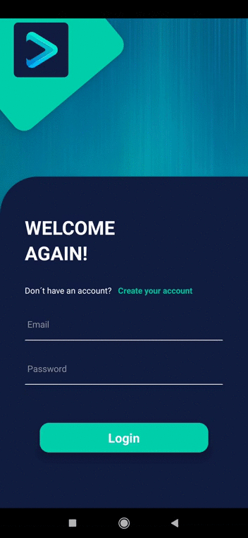

# Video-App React Native

## Technologies

 - [React Native](https://facebook.github.io/react-native/)
 - [Redux](https://redux.js.org/)
 - [Redux Thunk](https://github.com/reduxjs/redux-thunk)
 - [React Native Firebase](https://rnfirebase.io/)
 - [Styled Components](https://styled-components.com/)
 - [React Navigation](https://reactnavigation.org/)
 - [React Native Webview](https://github.com/react-native-community/react-native-webview)
 - [React Video](https://github.com/react-native-community/react-native-video)

 ## API
 - [Movie API](https://developers.themoviedb.org/3/getting-started/introduction)

 ## Run the project

 - Clone repository
 - Run 'npm install' or 'yarn install'
 - Run 'react-native run-android'
 - Use a phone simulator or physical device

 Login:

 

 Register:

 

 Home movies:
 
 
 
 Dark and light theme:
 
 
 
 Lenguage:
 
 

 Detail movie:
 
 

